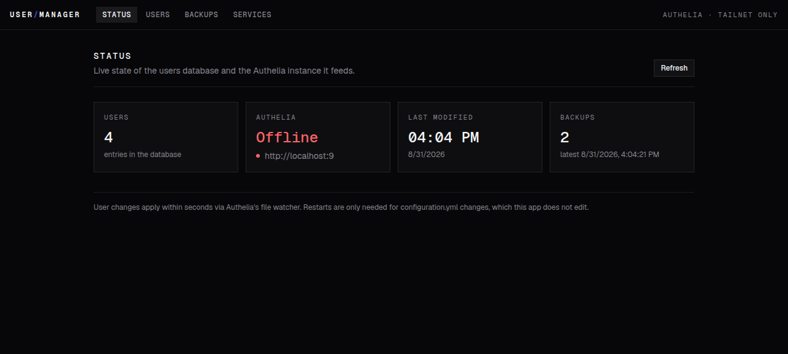
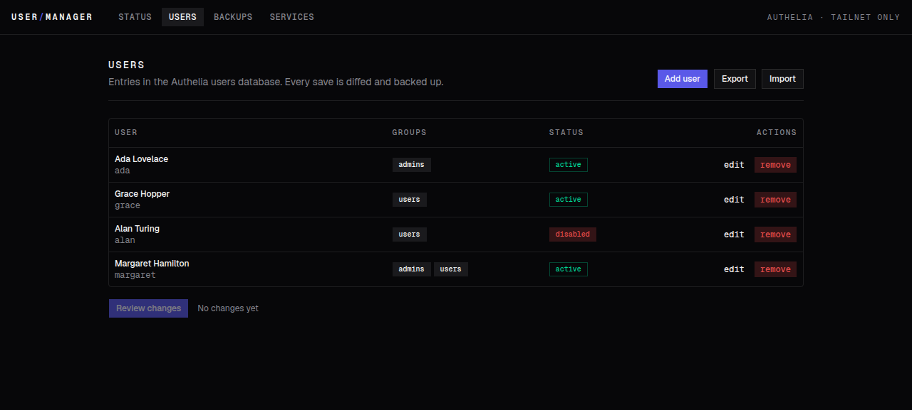
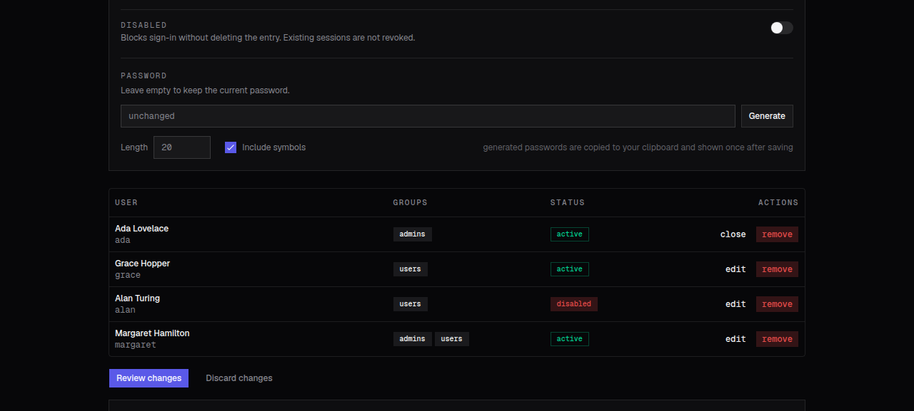
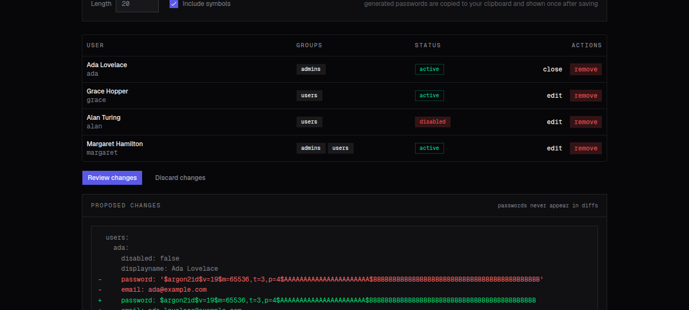
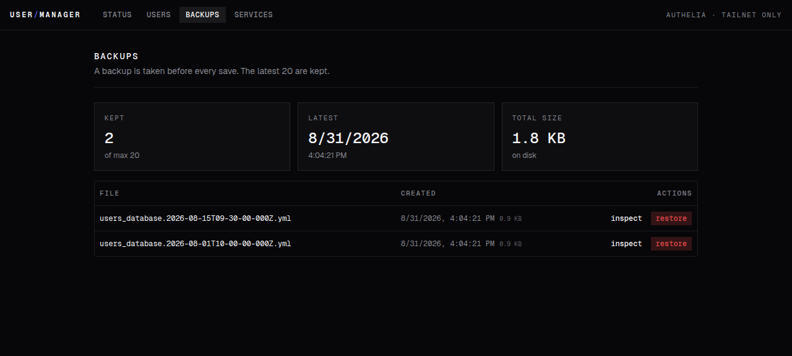
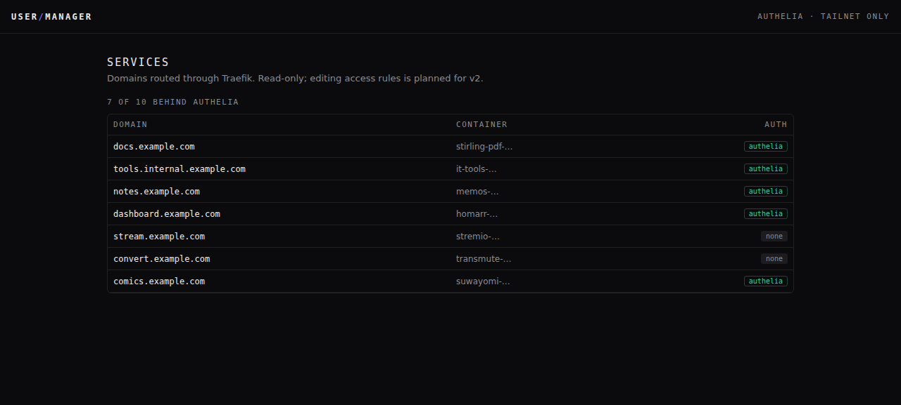

# vps-ts-user-manager

A web app for managing Authelia users on a self-hosted server. Authelia stores its users in a YAML file; this app gives that file a UI, so adding a user or resetting a password is a form fill instead of an SSH session and a text editor.

## What it does

- **Users.** Create, edit, disable, remove. Password resets use an argon2id generator with length and symbol options; generated passwords land on your clipboard and are shown once.
- **Diff review.** Every save shows the exact YAML diff first. Nothing is written until you confirm it.
- **Backups.** The app copies the file before each save and keeps the last 20. Any backup can be inspected against the current state and restored in one click.
- **Stale-guard.** If the file changed since you loaded the page, the save is rejected instead of clobbering whoever edited it.
- **Status.** Authelia reachability, last-modified time of the user database, backup info.
- **Services** (read-only). Lists every Traefik-routed domain and whether it sits behind the `authelia@file` middleware.

The screenshots below use mock data.

## Screens

| Status                                                             | Users                                                            |
| ------------------------------------------------------------------ | ---------------------------------------------------------------- |
|  |  |

| Edit                                                                           | Diff review                                                                  |
| ------------------------------------------------------------------------------ | ---------------------------------------------------------------------------- |
|  |  |

| Backups                                                              | Services                                                               |
| -------------------------------------------------------------------- | ---------------------------------------------------------------------- |
|  |  |

## How it works

The app reads and writes `users_database.yml` directly; it keeps no database of its own. Writes are atomic (temp file plus rename) and validated before they touch disk. Passwords are hashed with argon2id using Authelia's recommended parameters.

Authelia's file backend runs with `watch: true`, so saved changes apply within seconds without a restart.

## Running locally

Requires [bun](https://bun.sh).

```bash
bun install
bun run dev        # http://localhost:3001
```

Local development uses a fixture at `apps/web/data/dev-users_database.yml`. Copy `apps/web/.env.example` to `apps/web/.env` to configure paths:

| Variable        | Default                      | Purpose                              |
| --------------- | ---------------------------- | ------------------------------------ |
| `USERS_DB_PATH` | `/config/users_database.yml` | Path to the Authelia users database  |
| `BACKUPS_DIR`   | `/config/backups`            | Where rolling backups are written    |
| `AUTHELIA_URL`  | `http://authelia:9091`       | Health-check endpoint                |
| `DOCKER_SOCKET` | `/var/run/docker.sock`       | Docker socket for the services panel |

## Deploying

The repo root has a `docker-compose.yml`. Point it at your Authelia config directory by setting `AUTHELIA_CONFIG_DIR`, then run it behind your reverse proxy however you like. On a Tailscale network, a split-DNS entry in coredns pointing the app's hostname at the host's tailnet IP keeps it off the public internet entirely.

## Checks

```bash
bun run verify      # format check + typecheck + lint (deny warnings)
bun run lint:fix    # autofix lint issues
bun run format      # autofix formatting
```

Linting uses [oxlint](https://oxc.rs) with the vendored [anti-slop](https://github.com/dmmulroy/anti-slop) rules in `tools/anti-slop`.
